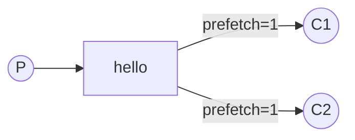
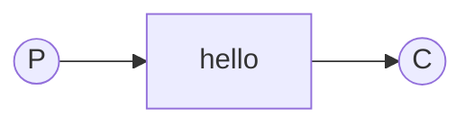
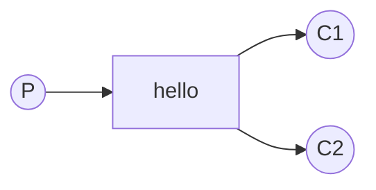

# RabbitMQ

RabbitMQ is a message broker: it accepts and forwards messages. You can think about it as a post office: when you put the mail that you want posting in a post box, you can be sure that the letter carrier will eventually deliver the mail to your recipient. In this analogy, RabbitMQ is a post box, a post office, and a letter carrier.

The major difference between RabbitMQ and the post office is that it doesn't deal with paper, instead it accepts, stores, and forwards binary blobs of data ‒ messages.

## Concepts

### Message acknowledgment

Doing a task can take a few seconds. You may wonder what happens if one of the consumers starts a long task and dies with it only partly done. With our ***"Hello World"*** code, once RabbitMQ delivers a message to the consumer it immediately marks it for deletion. In this case, if you terminate a worker we will lose the message it was just processing. We'll also lose all the messages that were dispatched to this particular worker but were not yet handled.

But we don't want to lose any tasks. If a worker dies, we'd like the task to be delivered to another worker.

An ack(acknowledgement) is sent back by the consumer to tell RabbitMQ that a particular message has been received, processed and that RabbitMQ is free to delete it.

If a consumer dies (its channel is closed, connection is closed, or TCP connection is lost) without sending an ack, RabbitMQ will understand that a message wasn't processed fully and will re-queue it. If there are other consumers online at the same time, it will then quickly redeliver it to another consumer. That way you can be sure that no message is lost, even if the workers occasionally die.

A timeout (30 minutes by default) is enforced on consumer delivery acknowledgement. This helps detect buggy (stuck) consumers that never acknowledge deliveries.

```csharp
Worker/Worker.cs

consumer.ReceivedAsync += async (model, ea) =>
{
    ...
    await channel.BasicAckAsync(deliveryTag: ea.DeliveryTag, multiple: false);
};

await channel.BasicConsumeAsync("task_queue", autoAck: false, consumer: consumer);
```

### Message durability

We have learned how to make sure that even if the consumer dies, the task isn't lost. But our tasks will still be lost if RabbitMQ server stops.

When RabbitMQ quits or crashes it will forget the queues and messages unless you tell it not to. Two things are required to make sure that messages aren't lost: we need to mark both the queue and messages as durable.

> **RabbitMQ doesn't allow you to redefine an existing queue with different parameters and will return an error to any program that tries to do that.**

```csharp
NewTask/NewTask.cs
Worker/Workers.cs

await channel.QueueDeclareAsync(queue: "task_queue", durable: true, exclusive: false,
    autoDelete: false, arguments: null);
```

```csharp
NewTask/NewTask.cs

var properties = new BasicProperties
{
    Persistent = true
};
```

### Fair Dispatch

In a situation with two workers, when all odd messages are heavy and even messages are light, one worker will be constantly busy and the other one will do hardly any work. Well, RabbitMQ doesn't know anything about that and will still dispatch messages evenly.

This happens because RabbitMQ just dispatches a message when the message enters the queue. It doesn't look at the number of unacknowledged messages for a consumer. It just blindly dispatches every n-th message to the n-th consumer.



In order to change this behavior we can use the `BasicQos` method with the `prefetchCount` = `1` setting. This tells RabbitMQ not to give more than one message to a worker at a time. Or, in other words, don't dispatch a new message to a worker until it has processed and acknowledged the previous one. Instead, it will dispatch it to the next worker that is not still busy.

```csharp
Worker/Worker.cs

await channel.BasicQosAsync(prefetchSize: 0, prefetchCount: 1, global: false);
```

> If all the workers are busy, your queue can fill up. You will want to keep an eye on that, and maybe add more workers, or have some other strategy.

## Jargon

### Producer

A program that sends messages is a ***producer***.

### Queue

A queue is the name for the post box in RabbitMQ. Although messages flow through RabbitMQ and your applications, they can only be stored inside a queue. A queue is only bound by the host's memory & disk limits, it's essentially a large message buffer.

Many producers can send messages that go to one queue, and many consumers can try to receive data from one queue.

### Consumer

A ***consumer*** is a program that mostly waits to receive messages.

## Examples

### Hello World

In this part of the tutorial we'll write two programs in C#; a producer that sends a single message, and a consumer that receives messages and prints them out.



### Work Queue (Task Queue)

In this one we'll create a Work Queue that will be used to distribute time-consuming tasks among multiple workers.

The main idea behind Work Queues (aka: Task Queues) is to avoid doing a resource-intensive task immediately and having to wait for it to complete. A worker process running in the background will pop the tasks and eventually execute the job. When you run many workers the tasks will be shared between them.

#### Round-robin dispatching

One of the advantages of using a Task Queue is the ability to easily parallelise work. If we are building up a backlog of work, we can just add more workers and that way, scale easily.

By default, RabbitMQ will send each message to the next consumer, in sequence. On average every consumer will get the same number of messages. This way of distributing messages is called round-robin. Try this out with three or more workers.

#### 

